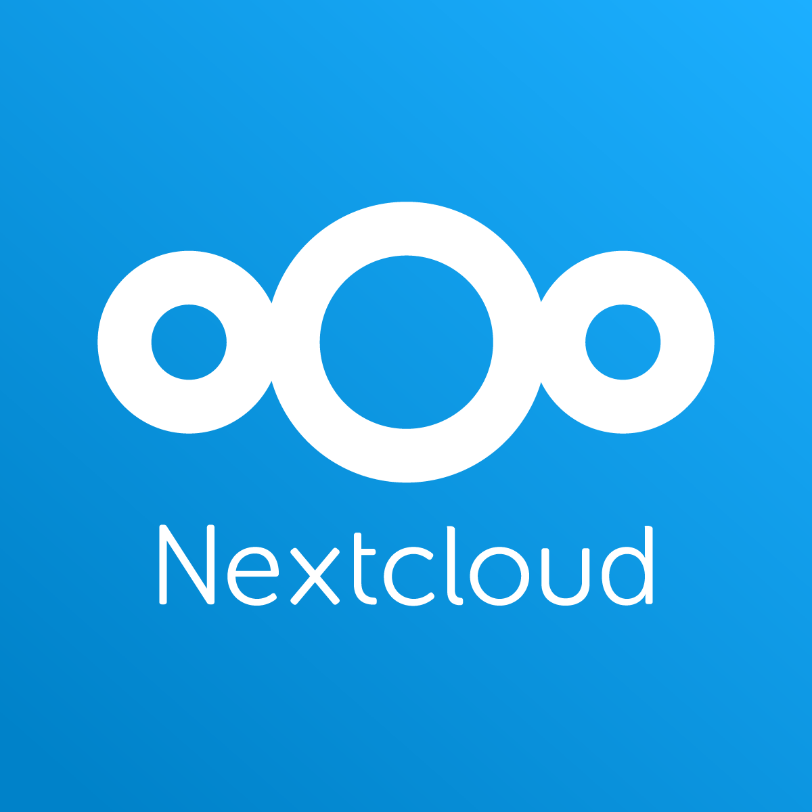

# 🎬 공학도서관 오리지널 컨텐츠

# ☁️ 라즈베리파이 파일서버 만들기

## 📝 프로젝트 소개
이 프로젝트는 라즈베리파이를 활용하여 개인 클라우드 서버를 구축하는 과정을 설명합니다. NextCloud Pi를 설치하여 자신만의 파일 저장소를 만들고 스마트폰과 연동하여 사용할 수 있습니다.

> ⚠️ **주의**: 이 프로젝트는 공유기가 접근 가능한 곳에서만 가능합니다.

## 📚 사전학습
이 프로젝트를 시작하기 전에 아래 내용을 먼저 공부하고 오시면 좋아요.

- 라즈베리파이 기초
  - SD 카드 이미지 굽기
  - 네트워크 연결 방법

- 네트워크 기초
  - IP 주소 개념
  - 포트 번호 이해
  - 방화벽 설정

- 클라우드 시스템
  - 파일 공유 개념
  - 보안 설정 이해
  - 사용자 권한 관리

## 🛠 준비물
- 라즈베리파이 4
- 마이크로 SD 카드 (최소 16GB)
- 이더넷 케이블
- 전원 어댑터
- SD 카드 리더기
- Raspberry Pi Imager
- NextCloud Pi 이미지 파일

## 🚀 시작하기
1. NextCloud Pi 이미지 준비
   - NextCloud Pi 공식 GitHub 페이지 방문
   - [최신 이미지 파일 다운로드](https://github.com/nextcloud/nextcloudpi/releases/download/v1.55.3/NextcloudPi_RaspberryPi4_v1.55.3.zip)
   - 다운로드한 압축 파일 풀기

2. SD 카드에 이미지 굽기
   - Raspberry Pi Imager 실행
   - 'Choose Device'에서 Raspberry Pi 4 선택
   - 'Choose OS'에서 'Use custom' 선택
   - 다운로드한 NextCloud Pi 이미지 선택
   - 'Choose Storage'에서 SD 카드 선택
   - 'Write' 버튼 클릭하여 이미지 굽기 시작

3. 라즈베리파이 설정
    > ⚠️ **주의**: 이더넷 케이블은 현재 집에서 사용하고 있는 공유기에서 나온 이더넷 케이블을 연결하기
   - SD 카드를 라즈베리파이에 삽입
   - 이더넷 케이블 연결
   - 전원 연결
   - 이더넷 포트의 LED가 깜빡이는지 확인

4. NextCloud 초기 설정
   - 웹 브라우저에서 NextCloud Pi 접속
   - 초기 계정 정보 저장
     - NextCloud Pi 관리자 계정/비밀번호
     - 클라우드 계정/비밀번호
   - 'Activate' 버튼 클릭

5. 관리자 설정
   - https://[IP주소]:4443 으로 접속
   - 사용자 이름: ncp
   - 저장해둔 비밀번호로 로그인
   - 초기 설정 마법사 실행
   - USB 저장소 사용 여부에서 'No' 선택

6. 보안 설정
   - 우측 상단 사용자 프로필 → 관리자 설정
   - '개인' 탭 → '보안' → 비밀번호 변경
     - 현재 비밀번호 입력
     - 새 비밀번호 설정 (10자 이상)
   - '시스템' 탭에서 IP 주소 확인

7. 모바일 앱 연동
   - 관리자 설정 → 보안 탭
   - 새로운 앱 이름 입력
   - QR 코드 생성
   - 스마트폰에서 NextCloud 앱 설치
   - QR 코드로 로그인
   - 테스트 사진 촬영 및 업로드

8. 동작 확인
   - 웹 브라우저에서 파일 확인
   - 업로드/다운로드 테스트
   - 모바일 앱 동기화 확인

## 🔍 문제해결
- 웹페이지에 접속이 안돼요
  - 이더넷 케이블이 제대로 연결되어 있는지 확인해보세요.
  - IP 주소가 정확한지 확인해보세요.
  - 포트 번호(4443)를 정확히 입력했는지 확인해보세요.

- 로그인이 안돼요
  - 사용자 이름이 'ncp'가 맞는지 확인해보세요.
  - 비밀번호를 정확히 입력했는지 확인해보세요.
  - Caps Lock이 켜져있는지 확인해보세요.

- 파일 업로드가 안돼요
  - 저장 공간이 충분한지 확인해보세요.
  - 파일 크기 제한을 확인해보세요.
  - 네트워크 연결 상태를 확인해보세요.

## 🌟 이렇게 업그레이드 해볼 수 있어요
- 저장 공간 확장하기
  - 외장 하드 연결해서 용량 늘리기
  - NAS 기능 추가하기

- 보안 강화하기
  - HTTPS 인증서 적용하기
  - 2단계 인증 설정하기
  - 자동 백업 시스템 구축하기

- 추가 기능 설정하기
  - 캘린더 기능 활용하기
  - 문서 공동 작업 환경 만들기
  - 사진 자동 동기화 설정하기

## 📚 참고 자료
- [NextCloud Pi 공식 문서](https://github.com/nextcloud/nextcloudpi)

> **주의사항**: 
> - 중요한 파일은 반드시 백업해두세요.
> - 초기 비밀번호는 반드시 변경하세요.
> - 정기적으로 시스템 업데이트를 확인하세요.
> - 공유 링크 생성 시 보안 설정을 확인하세요.

